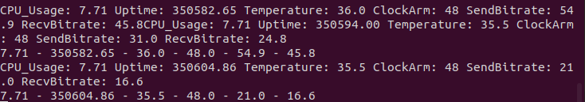
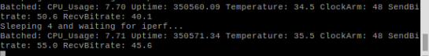
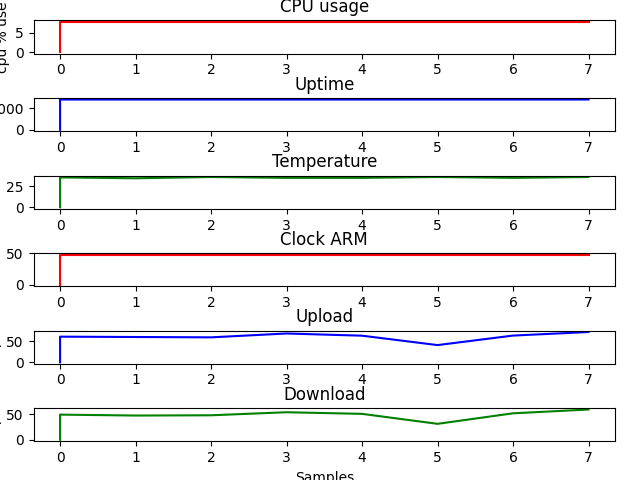

# rpi_parameter_analyzer

Project aims to create software in client-server architecture, which will be used to transmit real-time data about Raspberry Pi device (CPU usage, RPi uptime, RPi temperature, RPi clock arm and networks capabilities).

Project has two files, *client.py* and *server.py* which should be ran on correct device. *server.py* is created to receive data and parse data from the connected client. This file should be executed on your local machine. It only prints and plots received data. *client.py* on the other hand is written for sending real-time data retrieved from RPi (script assumes that is being executed on Raspberry Pi).

## Usage

Firstly run **server.py** on local / main machine (please make sure, to run it with sudo priviliges. Those priviliges are used only to retrieve mac_address from connected client).

```bash
sudo python3 server.py --ip 0.0.0.0 --port 3305 --buffer 1024
```

Secondly, you can run **client.py** on RPi:

```bash
python3 client.py --ip 192.168.1.1 --port 3305 --buffer 1024 --transmit_time 4
```

## Example output

Local machine:

<p align="center">
  
</p>

RPi output:

<p align="center">
  
</p>

Plotted data:

<p align="center">
  
</p>

## Authors

Mateusz Rzeczyca - student AGH University of Science and Technology - [rzeczyca@student.agh.edu.pl](mailto:rzeczyca@student.agh.edu.pl)

Mateusz Adamek - student AGH University of Science and Technology - [madamek@student.agh.edu.pl](mailto:madamek@student.agh.edu.pl)

## License

See the [LICENSE.md](https://github.com/Mregussek/rpi_parameter_analyzer/blob/master/LICENSE.md) file for details
